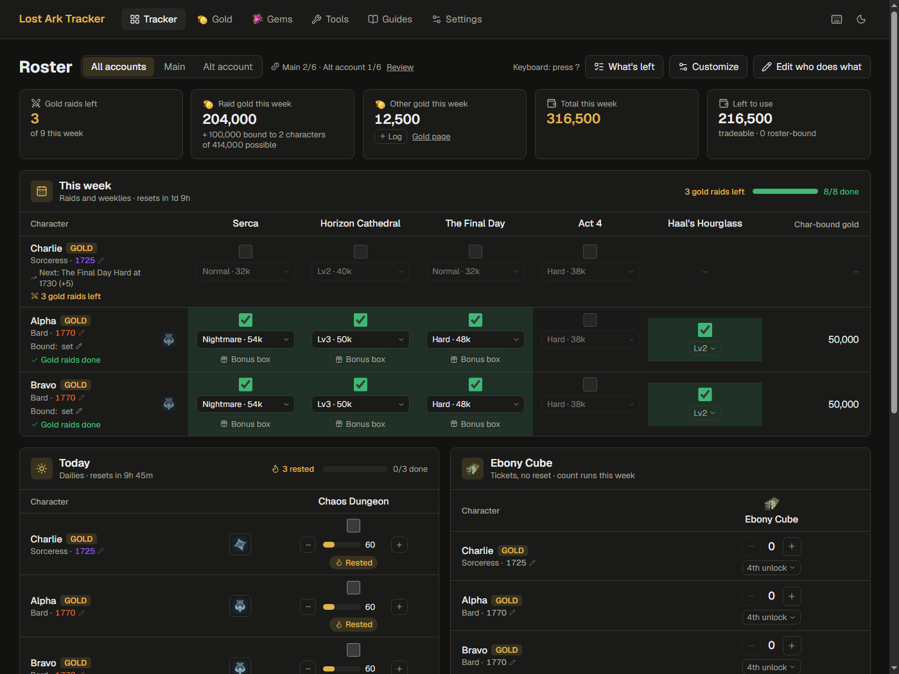
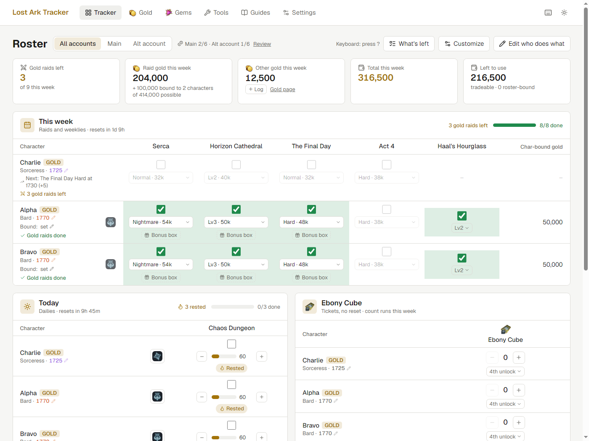
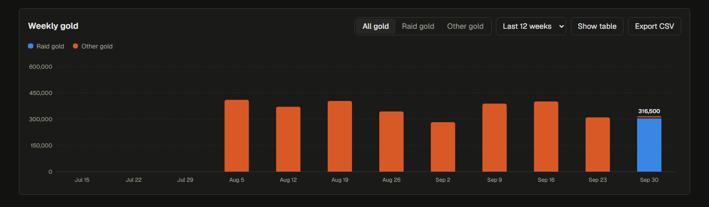

# Lost Ark Tracker

A roster tracker for Lost Ark: check off dailies, weeklies, and raids per
character, across one or more game accounts, and log gold from non-raid
sources to see your weekly gold over time.



<details>
<summary>Light mode, and the Gold page's weekly chart</summary>





</details>

The screenshots use made-up characters.

## What makes it different

- **Local and private.** One program on your computer, with your data in a
  file next to it. No account, no sign-in, no ads, nothing sent anywhere
  unless you turn on one of the few clearly labelled online extras.
- **Knows the game's rules.** 3 paid raids per character, 6 gold earners
  per account, bound gold and the order it's spent in, bonus boxes, rest
  bonus, Extreme events that pay once per roster. Raid values come with
  each update, checked against the patch notes.
- **Made for the weekly routine.** Tick a clear, see what's left and what
  it pays, and look back at where your gold and gems came from.

- **First run**: three short steps: how much to track, add your characters
  (paste a roster or one at a time, with class icons), and who earns gold.
- **Tracker**: three cards, by how often things reset.
  - **This week**: raids and Haal's Hourglass (1730+), reset Wednesday 10:00
    UTC. Each raid shows a checkbox, a difficulty dropdown, and once cleared a
    "Bonus box" button. Raids a character can enter but doesn't usually run
    show faded, so an extra clear can be ticked. **GOLD** beside a name
    toggles whether the character earns raid gold (6 per account; the count
    shows next to the account tabs). Item levels are coloured by the best raid
    tier they reach (hover for which), the card's header counts gold raids
    left, and a big roster scrolls inside the card with its header row
    pinned. After an update that changes raid values, a one-time note lists
    what changed. Non-earners get no raid gold, so their
    cells show none, and their bonus boxes are free for 3 raids a week.
    "Raid gold this week" shows tradeable + roster-bound gold, with
    character-bound gold and how many characters it's on beneath. The
    **gold goal** widget counts tradeable gold only or tradeable + roster-bound
    (the default), each with its own target.
  - **Today**: Chaos Dungeon (and Guardian Raid if you turn it on), reset
    daily at 10:00 UTC.
  - **Ebony Cube** (tickets, no reset): run counters for the character's own unlock
    (Kurzan Front / Chaos Rift tickets); the unlock button counts lower unlocks
    from guild shop boxes and lucky rooms.
  - **Customize** starts from a play style (Just raids, Raids + dailies, or
    Everything), then lets you tick every card, column, gold box and menu
    page on or off, and tuck away characters who are done (saved per
    browser). Changes apply when you press **Save**; **Cancel** or Esc
    discards them. The top boxes count gold raids left and log other gold in one
    step. Optional widgets chart the past month of gold, project a gold goal
    (from your last check-in) and show when your tracked gems add up to the
    next Lv9 / Lv10, and a compact **auction calculator** sits beside them
    for bidding mid-raid. The gold and gem widgets switch between this week,
    the last 4 weeks and all time. **Rearrange the page** (in Customize) lets
    you drag any block (the gold boxes, recap, cards, widgets) by its name, or
    use its arrows; "Reset order" puts it back and **Done** finishes. More you can turn on under Customize: a **reset
    clock** (next daily and weekly reset in your time and UTC) and
    **counters** you keep by hand (collectibles, tokens, reputation: a name,
    a number, an optional target and +1 / −1, for a character, an account or
    everyone), and **raid groups** for your statics (raid, time, members,
    some of them other players): each shows which of your characters in it
    still need the raid this week. A **Lost Ark updates** widget shows live NA/EU server
    status and official announcements, with the official X accounts
    (@LAGameStatus, @playlostark) a tab away. **Edit who does what** sets each
    character's usual raids and tasks; the pencil by an item level updates it.
  - **What's left** switches the cards to a list of only unfinished tasks per
    character, richest first, with one-click ticks and **Copy as text** for
    Discord.
  - Each character's **class icon** sits beside their name, so you can tell
    who's who at a glance. **All** beside a character ticks off everything
    they have left in that card.
    After the Wednesday reset, a recap shows last week's gold, gems and any
    gold raids left unrun.
  - On a phone or narrow window, each character gets a stacked block instead
    of a wide table.
  - Mistakes can be undone from the toast that follows a tick, "All" or a
    delete. Press **?** for keyboard shortcuts: arrows, Home and End move
    between cells (also right after clicking a checkbox), Space ticks, + / −
    count runs, `a` marks a character done, `g` then a letter jumps pages.
  - **Settings → Appearance**: text size (Small, Default, Large) and density
    (Comfortable, Compact), saved per browser.
  - Optional **reminders** (Settings) nudge you a few hours before the weekly
    reset if gold raids are left, and before the daily reset if a rest gauge is
    full. They come as browser notifications (or a banner) while the app is open.
- **Import clears from LOA Logs** (opt-in, Settings): if you run the LOA Logs
  DPS meter (Windows/Linux), the tracker reads the raids it saw you clear this
  week, read-only, matches bosses to raids and names to characters, and ticks
  the ones you keep after you review them (with Undo).
- **Suggest my gold setup** (Settings) picks, per account, the 6 gold earners
  and each one's 3 best-paying raids and difficulties, shows the gain against
  your current setup, and applies it in one click (with Undo). Bound gold can
  count fully, half, or not at all.
- **Tools** (`g` `o`): helpers to keep open beside the game. For honing,
  sites like Honing Forecast and Maxroll's upgrade calculator do it best, so
  the Tools page points to them under Guides → Honing and gear.
  - **Astrogem cutting**: keep it beside the game while you process a gem.
    It looks like the game's dark **Processing** window (original artwork):
    the grade (Uncommon 5, Rare 7, Epic 9 attempts), the gem type (Order:
    Stability, Solidity, Immutability; Chaos: Corrosion, Distortion,
    Destruction), Willpower Efficiency and Points above and below a dial with
    the two effects either side, then the 4 options offered, the processing
    cost and attempts left. Pick the gem type and its two effects, set the
    levels, attempts and refreshes, pick the 4 options the game offers from
    dropdowns, and it says **process**, **refresh** or **stop** (goal met, or out
    of reach), with your chance of reaching the goal (total points, plus
    minimum levels if you want) and the gold it'll take. Click the option the
    game applied (or press 1-4; r = refresh used, u = undo, f = finish).
    A session log counts gems, grades and gold, and "Log as spending" adds it
    to the Gold page. Odds are Smilegate's official table (one of the 4 shown
    options is applied, 25% each); every number is editable, with Reset.
- **Guides** (`g` `u`): a short, hand-picked list of guides, calculators
  and databases (Maxroll, the official patch notes, honing and astrogem
  calculators, LOA Logs, lostark.bible, ...), searchable and grouped by
  category. Add your own links (your guild's Discord, a creator you follow),
  hide built-in ones and bring them back. Links open in your browser; the
  tracker loads nothing from them. On a phone or narrow window the menu shows
  icons, with the current page's name.
- **Paste a roster** (Settings): add many characters at once from pasted
  lines of name, class and item level, in any order (typed, or copied from a
  spreadsheet or a roster page). It previews what it read, skips duplicates,
  and makes the highest item levels gold earners. Nothing is looked up online.
- **Accounts**: play more than one account? Add accounts in Settings and put
  each character on one. Each account is its own roster (up to 6 gold earners,
  its own event clears, its own gold and check-ins). The tracker, Gold and
  Gems pages get a switcher to view one account or all of them.
- **Rest bonus**: Chaos Dungeon and Guardian Raid cells show each character's
  rest gauge, highlighted in gold when a rested run is available today. Click
  the number to match it to the game.
- **Raids**: Act 4, The Final Day, Serca and Horizon Cathedral. Item levels,
  gold, bound gold and bonus box costs come with each app update (checked
  against the patch notes), so there's nothing to keep up to date yourself;
  Settings → Raids has a read-only **raid reference** and the date the values
  were last reviewed.
  - Each character is paid for 3 raids a week.
  - Gold is split into tradeable, roster-bound (half of Serca Normal) and
    character-bound (Cathedral), on the tracker and the Gold page.
  - Tick "+ bonus" on a cleared raid when you buy its bonus ("View More")
    chests. Like the game, they're paid from that character's
    character-bound gold first, then roster-bound, then tradeable. The
    tracker's top-right box shows the tradeable and roster-bound gold left;
    each character's row shows its character-bound gold left.
  - **Settings → Raids → Event raids** adds limited-time raids (e.g. "Act 3
    Extreme"). Pick the raid, check the pre-filled difficulties, done. Events are one clear
    per account, pay any character, and disappear when they end.
- **Gold**: log Field Boss, Chaos Gate, Fate Ember, etc., and chart weekly gold
  (raid clears + logged gold). **By source** shows what each source (raids,
  Chaos Gate, ...) paid this week, over the last 4 weeks and per week on
  average. A **weekly history** grid shows each character's paid
  gold raids and gold over the last 8 weeks. An **auction calculator** gives the break-even and
  recommended bid for a raid drop (4 or 8 players, with or without the 5%
  market fee).
  - **Gold on hand**: once a week (or whenever you like), enter how much
    tradeable and roster-bound gold you have. Character-bound gold is set
    per character on the tracker ("Bound" under the name, shown for
    characters whose raids pay it) and kept up to date from their clears and
    spending, so you only enter it again if it drifts. The app
    compares it with your last check-in plus everything it tracked since, so
    you see how much went to things it doesn't track (honing, the market, ...)
    without logging each one. The tracker reminds you after the weekly reset.
  - **Spending**: log gold you spent (honing, gems, market, other) with an
    optional character and note. Check-ins subtract it, so "untracked" is only
    what you didn't log. Market purchases come out of tradeable gold; the rest
    uses the character's bound gold first, then roster-bound, then tradeable
    (or choose tradeable only). Totals for the last 30 days; CSV export.
- **Gems**: Ebony Cube and Haal's Hourglass gems are counted from the tracker
  using each tier's reward table (shown on the Gems page; known values come
  with updates, and you can fill in any that aren't known yet, like most
  lucky rooms). Log Guardian
  Raid and Field Boss drops by hand. Weekly chart and per-character totals in
  terms of what your gems combine into (3 of a level make the next, so 15 Lv1
  gems are a Lv3 + 2× Lv2).
- **Export**: "Export CSV" on the Gold and Gems pages downloads your full
  history for a spreadsheet; the spending log has
  its own export.
- **Game icons**: class emblems and item icons (gold, gems, astrogems, the
  Ebony Cube ticket, Fate Ember, Paradise) ship inside the app, so nothing
  is loaded from the web. Each file and its source is listed in
  `frontend/public/game-icons/SOURCES.md`; Lost Ark and its images are
  trademarks and property of Smilegate RPG / Amazon Games.
- **Settings**: add characters (their usual raids are pre-selected from item
  level), edit daily/weekly columns, and download/restore backups.

## Using it

1. Download the file for your system from the
   [latest release](../../releases/latest):
   - Windows: `LostArkTracker-windows.exe`
   - macOS: `LostArkTracker-macos`
   - Linux: `LostArkTracker-linux`
2. Run it. The tracker appears in your browser at <http://127.0.0.1:8777>.
   - **Windows:** it runs from a gold "LA" icon in the system tray (near the
     clock). Right-click it to open the tracker, your data folder or the log,
     or to **Quit**. If something goes wrong, a message box says so.
   - **macOS / Linux:** a terminal window opens; keep it open while you use
     the tracker and close it to stop.

   Running it again while it's open just reopens the browser tab.
3. First time: the tracker walks you through adding your characters (or use
   **Settings**). Their usual raids are picked from item level, and you can
   adjust them before adding.

Everything stays on your computer. There are no accounts and none of your data is sent anywhere. See
[Privacy and network](#privacy-and-network) for the few optional things that go online.

Your data is saved here:

| System  | Location |
|---------|----------|
| Windows | `%APPDATA%\LostArkTracker\database.db` |
| macOS   | `~/Library/Application Support/LostArkTracker/database.db` |
| Linux   | `~/.local/share/lost-ark-tracker/database.db` |

Each day you open the app it also saves a copy in a `backups` folder next to
`database.db` (the last 10 days are kept). To restore one, close the app and
copy it over `database.db`. **Settings → Download backup** gives you a file
that restores your data on another computer, or after a reinstall.

**First-run warnings.** The downloads aren't code-signed (what that would take: `docs/signing.md`), so:
- **Windows** SmartScreen may say "Windows protected your PC". Click
  *More info → Run anyway*.
- **macOS**: run `chmod +x LostArkTracker-macos && xattr -d com.apple.quarantine LostArkTracker-macos`
  once in Terminal, then open it (or right-click → Open).
- **Linux**: `chmod +x LostArkTracker-linux` once, then run it.

**Updating.** With the update check on, the nav shows *Update available*
when there's a new release; click it for what's new, the download for your
system and the steps: quit the tracker, replace the old file with the new one,
run it. Your data stays where it is (above), so nothing is lost. The first run
after an update says so, with a link to what changed. The app doesn't download
or replace itself: unsigned files that swap themselves out are exactly what
antivirus tools flag (see `docs/signing.md`).

**If it won't start or something breaks,** a message box says so (Windows), or
the terminal window says so and stays open (macOS / Linux).
The details are in `tracker.log` in the same data folder, so send that file to
whoever's helping. If the database itself got damaged, close the app and copy
the newest file from `backups` over `database.db`.

Options: `--port 9000` to use another port, `--no-browser` to skip opening a
tab, `--data-dir PATH` to keep the database somewhere else.

## Privacy and network

Your roster, clears, gold and check-ins are stored only in the database on
your computer and are never uploaded. The app makes exactly these internet
requests, and only these:

| What | Contacts | When | Default |
|------|----------|------|---------|
| Update check | `api.github.com` (this repo's latest release, its notes and download links) | Once per browser session | Asked on first launch; existing users keep it on |
| Lost Ark updates widget | `www.playlostark.com` (server status page) and `api.steampowered.com` (Lost Ark news), fetched by the app | When the widget is on screen, then every 10 minutes while the tracker is open | Off |
| The widget's "On X" tab | `platform.twitter.com` / `x.com` (X's embed) | Only after you open that tab | Off (the widget is off) |

The optional **LOA Logs import** (Settings) only reads that meter's
`encounters.db` on your computer, read-only, when you click Import clears;
it never goes online.

Turn each one on or off in **Settings → Online features** (the widget also
in **Customize**). Links you click (patch notes, the status page) open in
your browser as usual. Fonts and everything else ship inside the app.

## Development

Backend (FastAPI + SQLite), from `backend/`:

```sh
python -m venv .venv
.venv\Scripts\activate        # macOS/Linux: source .venv/bin/activate
pip install -r requirements-dev.txt
uvicorn main:app --reload     # API at http://127.0.0.1:8000/api
python -m pytest              # tests
```

Frontend (Next.js), from `frontend/`:

```sh
npm install
npm run dev                   # http://localhost:3000, talks to the API above
```

In development the database is `backend/database.db`, separate from the
packaged app's. To move data between them, use Settings → Download backup in
one and Restore in the other.

### Building the app

With the backend venv active, from the repo root:

```sh
python build.py               # exports the frontend, then packages dist/LostArkTracker(.exe)
python scripts/smoke_test.py dist/LostArkTracker.exe   # starts it and checks the API and page
```

CI builds and smoke-tests the Linux binary on every push; the Release
workflow smoke-tests all three before attaching them.

PyInstaller only builds for the system it runs on. To publish downloads for
all three systems, bump `APP_VERSION` in `backend/version.py`, then push a
version tag:

```sh
git tag v1.1.0
git push origin v1.1.0
```

The Release workflow builds Windows, macOS and Linux binaries and attaches them
to a GitHub release. The CI workflow runs tests, lint, and a build on every
push to `main` and on pull requests.
